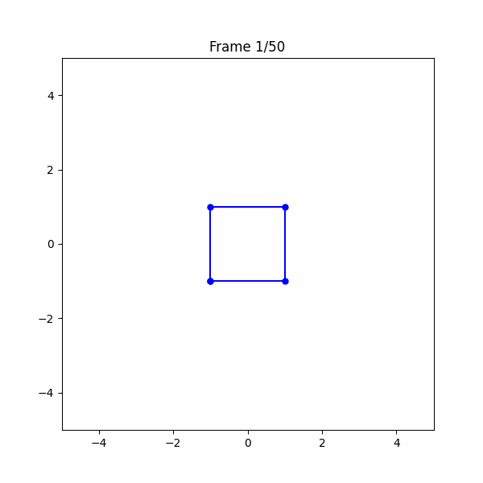
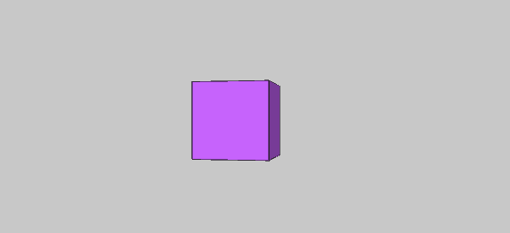
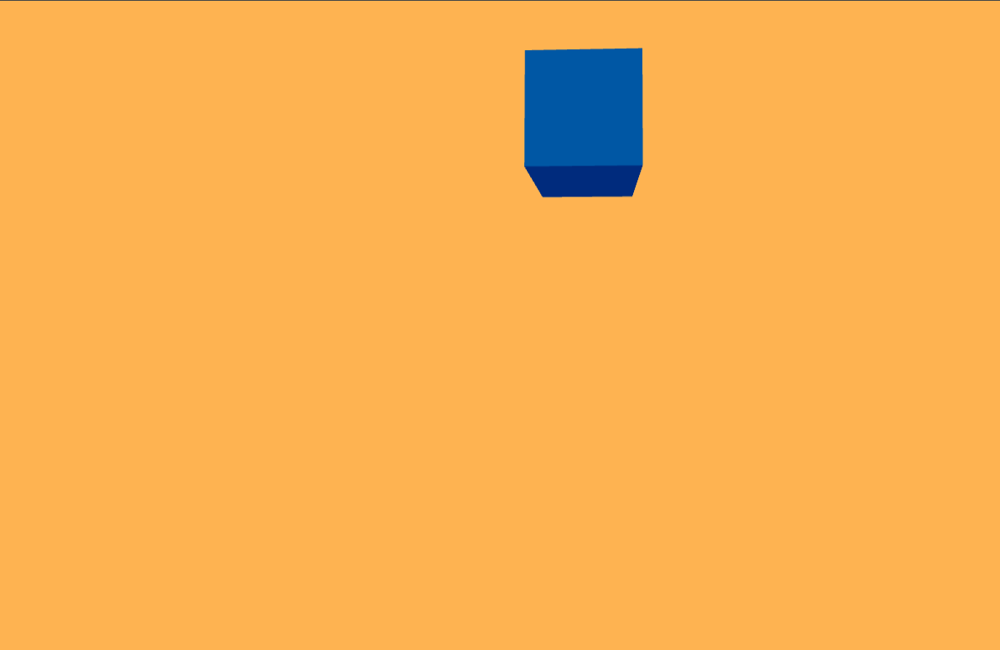

# Taller 1: Transformaciones Visuales

🧪 **Nombre del Taller**  
Taller 1: Transformaciones Visuales

📅 **Fecha**  
2025-04-15 – Fecha de entrega

🎯 **Objetivo del Taller**  
Explorar y aplicar transformaciones geométricas (traslación, rotación y escalado) en diferentes entornos de programación para comprender su implementación y visualización.

🧠 **Conceptos Aprendidos**  
- Transformaciones geométricas (escala, rotación, traslación)
- Animación de objetos en 2D y 3D
- Uso de librerías y frameworks para visualización gráfica

🔧 **Herramientas y Entornos**  
- Python (Matplotlib, NumPy, ImageIO)
- Processing (modo P3D)
- Three.js / React Three Fiber

📁 **Estructura del Proyecto**  
```
2025-04-15_taller1_transformaciones/
├── python/                 # Implementación en Python
├── processing/             # Implementación en Processing
├── threejs/                # Implementación en Three.js
├── resultados/             # Gifs de animaciones obtenidas
├── README.md               # Documentación del taller
```

## 🐍 1. Transformaciones con Matplotlib (Python)

Esta implementación utiliza Matplotlib para animar un cuadrado que sufre transformaciones geométricas como traslación, rotación y escalado, usando matrices homogéneas de transformación. El resultado es un GIF animado que muestra el movimiento del cuadrado en un espacio bidimensional.

### 💡 Características principales

- Uso de matrices homogéneas (3x3)
- Animación generada con `Matplotlib` e `imageio`
- Visualización de las transformaciones cuadro a cuadro
- Transformaciones combinadas: escalado → rotación → traslación

### Código relevante:
```python
def translacion(tx, ty):
    # Matriz de traslación 2D en coordenadas homogéneas.
    # Desplaza el objeto 'tx' unidades en X y 'ty' en Y.
    return np.array([
        [1, 0, tx],
        [0, 1, ty],
        [0, 0, 1]
    ])

def rotacion(theta):
    # Matriz de rotación alrededor del origen (en radianes).
    # Gira el objeto 'theta' radianes en sentido antihorario.
    return np.array([
        [np.cos(theta), -np.sin(theta), 0],
        [np.sin(theta),  np.cos(theta), 0],
        [0,              0,             1]
    ])

def escala(sx, sy):
    # Matriz de escalado no uniforme.
    # Amplía o reduce el objeto en 'sx' veces en X y 'sy' en Y.
    return np.array([
        [sx, 0,  0],
        [0,  sy, 0],
        [0,  0,  1]
    ])
```

### Resultado:
El cuadrado se traslada, rota y escala de manera continua, generando un movimiento fluido en un espacio bidimensional.




## 🌀 2. Cubo Animado en 3D (Processing)

En esta implementación, se utiliza Processing para animar un cubo en un espacio tridimensional. El cubo realiza movimientos sinusoidales, rotaciones continuas y cambios cíclicos de escala.

### 💡 Características principales

- Modo 3D activado (`P3D`)  
- Iluminación básica para realismo  
- Cálculo de transformación en función del tiempo (`millis()`)

### Código relevante:
```java
void draw() {
  background(200);  // Color de fondo gris claro
  lights();         // Agrega luces para que el objeto tenga volumen y sombreado realista
  pushMatrix();     // Guarda el sistema de coordenadas actual

  // Centra el objeto en el medio de la ventana
  translate(width/2, height/2, 0);

  float t = millis() / 1000.0;  

  float wave = sin(t) * 100;
  translate(wave, 0, 0);  // Traslación oscilatoria horizontal (movimiento sinusoidal)

  rotateY(t);  // Rotación continua en el eje Y (giro horizontal)

  float s = 1 + 0.5 * sin(t * 2); 
  scale(s);  // Escalado dinámico para simular un "latido" o pulso visual

  // Propiedades del cubo
  fill(200, 100, 255); 
  stroke(0);         
  box(100);            
  
  popMatrix();        
}

```

### Resultado:
El cubo se mueve de forma ondulatoria, rota continuamente y cambia de tamaño cíclicamente, creando un efecto dinámico en 3D.


---

## 🌐 3. Cubo Reactivo en 3D (Three.js + React)

Esta implementación utiliza Three.js y React para renderizar un cubo animado en un entorno web. El cubo realiza movimientos sinusoidales, rotaciones continuas y escalado suave.

- Traslación en trayectoria circular  
- Rotación en tres ejes  
- Escalado pulsante  
- Colores por vértice y materiales con efectos físicos

### 💡 Características principales

- Uso de `useFrame` para animaciones en tiempo real  
- Material físico (`MeshPhysicalMaterial`) con efectos de realismo  
- Interacción con `OrbitControls`

### Código relevante:
```jsx
// Movimiento sinusoidal circular en X e Y
meshRef.current.position.x = Math.sin(time) * 2.5;
meshRef.current.position.y = Math.cos(time) * 2.5;

// Rotación continua sobre los ejes X e Y
meshRef.current.rotation.x = time;
meshRef.current.rotation.y = time;

// Escalado suave pulsante
const scale = Math.sin(time) * 0.2 + 1.7;
meshRef.current.scale.set(scale, scale, scale);
```

### Resultado:
El cubo reacciona a movimientos sinusoidales, rota continuamente y cambia de tamaño de forma suave, ofreciendo una experiencia visual interactiva.

[Link para ver animación](https://computacion-visual.vercel.app)


---
## 🚀 Ejecución

### ✅ Python

1. Instala los paquetes necesarios:

```bash
pip install numpy matplotlib imageio
```
Ejecuta el notebook TransformacionesBasicas.ipynb.

### ✅ Processing
Abre el archivo TransformacionesBasicas.pde en el entorno de Processing.

Haz clic en Run para visualizar la animación.

### ✅ Three.js (React)
Navega a la carpeta del proyecto:

```bash
cd threejs/TransformacionesBasicas
```
Instala las dependencias:

```bash
npm install
```
Ejecuta el servidor de desarrollo:

```bash
npm run dev
```
Abre tu navegador en: http://localhost:5173


## Enlaces a los entornos

- **Python (Matplotlib):** [matplotlib_transformations.ipynb](python/matplotlib_transformations.ipynb)
- **Processing:** [AnimatedCube3D.pde](processing/AnimatedCube3D/AnimatedCube3D.pde)
- **Three.js + React:** [React3D-Playground](threejs/React3D-Playground/)

## ✍️ Autor
Sergio Alejandro Ruiz Hurtado

🧩 **Prompts Usados**  
- "Explicame el paso a paso para usar threejs"
- "Quiero que pases este escrito a formato Markdown"
- "Como crear un cubo 3D en processing."
- "Apartir del codigo en python exporta automaticamente el gift resultante"

💬 **Reflexión Final**  
Este taller permitió reforzar conceptos fundamentales de transformaciones geométricas y su implementación en diferentes entornos. La parte más interesante fue observar cómo las mismas transformaciones se aplican de manera similar en Python, Processing y Three.js, pero con diferencias en las herramientas y sintaxis. En futuros proyectos, sería interesante explorar transformaciones más complejas, como proyecciones en perspectiva o deformaciones no lineales.

✅ **Checklist de Entrega**  
- [x] Carpeta `2025-04-15_taller1_transformaciones`
- [x] Código limpio y funcional
- [x] GIF incluido con nombre descriptivo
- [x] README completo y claro
- [x] Commits descriptivos en inglés