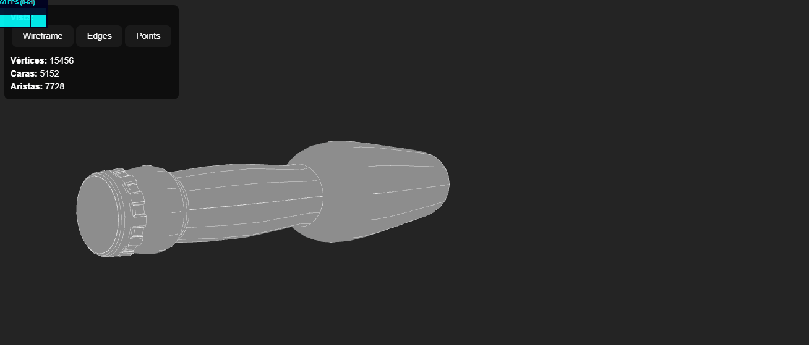

# 🧪 Taller construyendo mundo 3D

## 📅 Fecha

`2025-04-21` – Fecha de realización

---

## 🎯 Objetivo del Taller

Este taller tiene como objetivo explorar la construcción y visualización de un mundo 3D a partir de un modelo OBJ, aplicando colores personalizados a vértices, aristas y caras, generando animaciones rotacionales en Python (trimesh + vedo) y luego integrando el mismo modelo en un entorno web 3D con React Three Fiber.

---

## 🧠 Conceptos Aprendidos

Lista de conceptos clave aplicados en el taller:

- Manipulación y visualización de mallas 3D (vértices, aristas, caras) con `trimesh` y `vedo`
- Asignación de colores personalizados en geometrías 3D
- Generación de animaciones rotacionales y exportación a GIF
- Renderizado en tiempo real y controles de cámara interactivos (`OrbitControls`)
- Integración de modelos OBJ en entornos web con React Three Fiber
- Gestión de estado global para alternar vistas (wireframe, edges, points)

---

## 🔧 Herramientas y Entornos

Especifica los entornos usados:

- Python 3.x (`trimesh`, `vedo`, `numpy`, `imageio`, `matplotlib`)
- React / JavaScript (`@react-three/fiber`, `@react-three/drei`, `three`)
- Node.js / npm para gestionar dependencias de Three.js

---

## 📁 Estructura del Proyecto
```
2025-04-28_taller_construyendo_mundo_3d/
├── python/              # Implentacion python/
├── threejs/             # Implentacion react usando threejs/
├── datos/               # Modelos usados wolf.obj, Corona.obj
├── resultados/          # Gifs resultantes
├── README.md
```
## 🧪 Implementación

Explica el proceso:

### 🔹 Etapas realizadas

#### 🐍 Python
1. Instalación de librerías Python con `pip install trimesh vedo numpy matplotlib imageio`.
2. Carga del modelo OBJ (`wolf.obj`) con **trimesh** y limpieza de colores previos.
3. Asignación de colores a vértices (negro), aristas (rojo) y caras (amarillo claro).
4. Visualización estática en tres vistas (vértices, aristas, caras) usando **vedo**.
5. Generación de una animación rotacional y exportación como `rotacion.gif`.

#### 🌐 React.js
1. Configuración inicial del proyecto con **Vite** y las dependencias necesarias (`@react-three/fiber`, `@react-three/drei`, `three`).
2. Creación de un componente `Model` para cargar y renderizar el modelo OBJ, calculando el número de vértices, aristas y caras.
3. Implementación de un estado global con `zustand` para gestionar las vistas (wireframe, edges, points) y los contadores de vértices, aristas y caras.
4. Desarrollo del componente `UI` para permitir al usuario alternar entre vistas y mostrar los contadores.
5. Integración de los componentes `Model` y `UI` en el componente principal `App`, junto con un lienzo 3D (`Canvas`) y controles interactivos (`OrbitControls`).

###  🔹 Código relevante

### 🐍 Python (trimesh + vedo)  
_Explicación:_ Se crea una visualización estática de los vértices, aristas y caras de una malla tridimensional usando vedo, una biblioteca para visualización 3D en Python. Luego, genera una animación (rotacion.gif) donde la malla rota 360° alrededor de su eje, mostrando su estructura desde diferentes ángulos.

```python
# Definir colores
color_vertices = 'black'
color_aristas = 'red'
color_caras = (247, 255, 120)

# Visualización estática
plotter = vedo.Plotter(shape=(1,3), axes=0)
plotter.show(vedo.Points(mesh.vertices, c=color_vertices), at=0, title="Vértices")
plotter.show(
    vedo.Lines(mesh.vertices[mesh.edges[:,0]], mesh.vertices[mesh.edges[:,1]], c=color_aristas),
    at=1, title="Aristas"
)
mesh_v = vedo.Mesh([mesh.vertices, mesh.faces]).c(color_caras).lc(color_aristas)
plotter.show(mesh_v, at=2, title="Caras")

# Generar animación rotacional
def generar_animacion():
    p = vedo.Plotter(offscreen=True, bg='white')
    mesh_v = vedo.Mesh([mesh.vertices, mesh.faces]).c(color_caras).lc(color_aristas)
    frames = []
    for ang in np.linspace(0, 360, 72):
        p.show(mesh_v, azimuth=ang)
        frames.append(p.screenshot(asarray=True))
    imageio.mimsave('rotacion.gif', frames, fps=20)
    return Image('rotacion.gif')

generar_animacion()
```

### 🌐 React Three Fiber (App.jsx)

_Explicación:_ Este código implementa una aplicación web 3D que permite cargar un modelo OBJ y alternar entre diferentes vistas (wireframe, edges, points). El componente `Model` se encarga de cargar el modelo y calcular los contadores de vértices, aristas y caras, mientras que el componente `UI` proporciona una interfaz para cambiar las vistas y mostrar los contadores. El componente principal `App` integra todo en un lienzo 3D interactivo.

```jsx
import { Canvas } from '@react-three/fiber'
import { OrbitControls, Stats } from '@react-three/drei'
import Model from './Model'
import UI from './UI'

export default function App() {
  return (
    <div style={{
      height: '100vh', // Ocupa toda la altura de la ventana
      display: 'flex',
      flexDirection: 'column',
    }}>
      {/* UI en la parte superior */}
      <div style={{
        zIndex: 10, // Asegura que UI esté sobre el canvas
        position: 'relative',
        flexShrink: 0, // Impide que el UI se reduzca
      }}>
        <UI />
      </div>

      {/* Canvas ocupa el resto del espacio */}
      <div style={{ flex: 1 }}>
        <Canvas camera={{ position: [50, 0, 15], fov: 60 }}>
          <ambientLight />
          <pointLight position={[10, 10, 10]} />
          <OrbitControls />
          <Model />
          <Stats />
        </Canvas>
      </div>
    </div>
  )
}
```


## 📊 Resultados Visuales
### 🐍 Python   
Se observa el modelo, en este caso un lobo, con caras de color amarillo, vertices rojos y aristas 


### 🌐 React  
Interfaz interactiva alternando entre diferentes vistas (wireframe, edges, points)



---

🧩 Prompts Usados

- "Explicame como cargo un modelo 3D `.obj` en Python y usando `vedo` visualizar las caras, vertices y aristas del modelo con diferente color."
- "Genera una animación rotando el modelo 3D cargado con `vedo` y exporta el resultado como `.gif`."
- "Ayudame a crear un componente en Three Fiber que cargue un `.obj`, con la posibilidad permita orbitar la cámara y cambiar entre vista de caras, aristas y puntos, explicame la estructura del proyecto."

---

💬 Reflexión Final  

Durante este taller aprendí a manipular mallas 3D en Python usando trimesh y vedo, asignar colores diferenciados a vértices, aristas y caras, y generar animaciones exportables como GIF. La parte más compleja fue ajustar el tamaño de los puntos para que los vértices fueran visibles; en futuras iteraciones consideraría usar un tamaño mayor o un método de resaltado.

La integración del modelo en una aplicación web con React Three Fiber me permitió reforzar el manejo de estado global para cambiar entre vistas (wireframe, edges, points) y comprender mejor el pipeline de renderizado en Three.js.

Uno de los principales retos fue el manejo de formatos y la correcta conversión de datos entre librerías, especialmente en Python, y el control de visualización precisa de mallas en React. También fue necesario comprender bien conceptos como la geometría bufferizada (BufferGeometry) en Three.js y ajustar el renderizado de bordes y vértices.