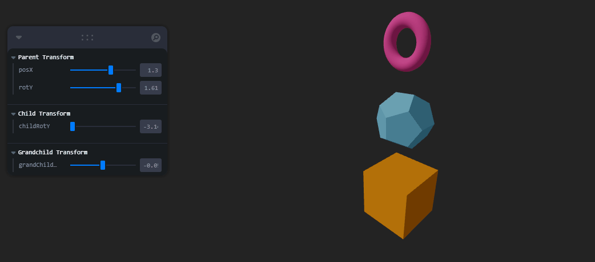

# 🧪 Taller - Jerarquías y Transformaciones: El Árbol del Movimiento

## 📅 Fecha  
2025-04-29 – Fecha de entrega

---

## 🎯 Objetivo del Taller

Aplicar estructuras jerárquicas y árboles de transformación en una escena 3D utilizando Three.js con React Three Fiber. Se busca comprender cómo las transformaciones (rotación y traslación) en un nodo padre afectan a sus hijos, nietos y demás niveles descendentes. Además, se implementan controles interactivos en tiempo real para manipular dichas transformaciones y visualizar su impacto.

---

## 🧠 Conceptos Aprendidos

- ✅ Transformaciones geométricas (escala, rotación, traslación)
- ✅ Jerarquías de objetos 3D
- ✅ Uso de `<group>` y `<mesh>` en estructuras anidadas
- ✅ Visualización de transformaciones encadenadas
- ✅ Uso de `leva` para UI de control en tiempo real
- ✅ Manipulación interactiva de escenas en React Three Fiber

---

## 🔧 Herramientas y Entornos

* ✅ Three.js / React Three Fiber
* Leva (para sliders interactivos)
* 🟡 Vite (como entorno de desarrollo con React)


📌 Se siguió la documentación oficial para instalación de Vite y React Three Fiber.

---

## 📁 Estructura del Proyecto
```
2025-04-29_arbol_movimiento/ 
├── threejs/ 
│ ├── src/ 
│ │ ├── App.jsx 
│ │ └── Scene.jsx 
│ └── public/ 
├── resultados/ 
│ └── movimiento_padre_hijo_nieto.gif 
├── README.md
```


---

## 🧪 Implementación

### 🔹 Etapas realizadas

1. **Preparación de escena**: Se creó un proyecto con Vite y se configuró React Three Fiber.
2. **Jerarquía padre-hijo-nieto**: Se usaron `<group>` para anidar objetos (cubo, esfera, cono).
3. **Transformaciones**: Se aplicaron transformaciones al grupo padre y se observaron sus efectos.
4. **Control en tiempo real**: Se usó `leva` para controlar posición y rotación del padre.
5. **Visualización y grabación**: Se generó un GIF demostrativo de los movimientos encadenados.

### 🔹 Código relevante
Este código define una jerarquía 3D en React Three Fiber usando <group>, donde un padre rota y mueve toda la estructura. El hijo (cubo naranja) está a la derecha del padre; sobre él, un nieto (esfera azul), y encima un biznieto (cono verde). Cada transformación se hereda: si el padre rota, todos sus descendientes también lo hacen. Esto permite observar efectos encadenados y simular movimiento relativo entre objetos.

```jsx
<group ref={parentRef}>
  {/* Hijo: cubo naranja */}
  <group ref={childRef} position={[2, 0, 0]}>
    <mesh>
      <boxGeometry args={[1, 1, 1]} />
      <meshStandardMaterial color="orange" />
    </mesh>

    {/* Nieto: esfera azul encima del cubo */}
    <group ref={grandChildRef} position={[0, 1.5, 0]}>
      <mesh>
        <sphereGeometry args={[0.5, 32, 32]} />
        <meshStandardMaterial color="skyblue" />
      </mesh>

      {/* Biznieto (cuarto nivel, opcional): cono verde sobre la esfera */}
      <mesh position={[0, 1.2, 0]}>
        <coneGeometry args={[0.3, 0.7, 32]} />
        <meshStandardMaterial color="green" />
      </mesh>
    </group>
  </group>
</group>
```

## 📊 Resultados Visuales

Se visualiza una jerarquía de objetos 3D conectados mediante grupos (<group>) en React Three Fiber. Al manipular sliders de rotación y traslación aplicados al grupo padre, se observa cómo toda la estructura se transforma en conjunto. El cubo naranja (hijo) se traslada respecto al padre, la esfera azul (nieto) se posiciona encima del cubo, y el cono verde (biznieto) se ubica sobre la esfera.



## 🧩 Prompts Usados

- Como funciona la estructura padre-hijo haciendo uso de <group> en react y threejs
- Explicame el paso a paso par aagregar un leva a los siguientes componenetes para controlar la rotacion de y translacion   
- Crea los estilos para que la escena ocupe todo contenido”  

---

## 💬 Reflexión Final
Este taller me ayudó a comprender de manera visual y práctica cómo funciona una jerarquía de transformaciones en 3D. Ver cómo una rotación en el nodo padre afecta a los hijos y nietos permite interiorizar el concepto de transformaciones relativas. Además, usar leva me permitió experimentar con los parámetros en tiempo real, lo cual refuerza la idea de manipulación interactiva.

La parte más interesante fue observar cómo se encadenan las transformaciones, especialmente al agregar un tercer nivel. La parte más retadora fue estructurar correctamente los grupos y aplicar los `ref` en cada uno para tener control sobre sus transformaciones. En el futuro, me gustaría expandir esto con animaciones automatizadas o con inputs gestuales.
