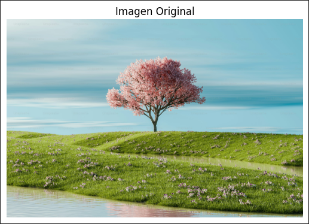
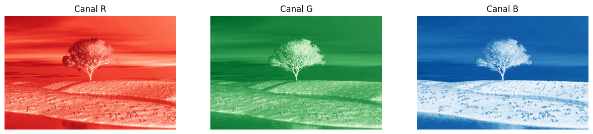
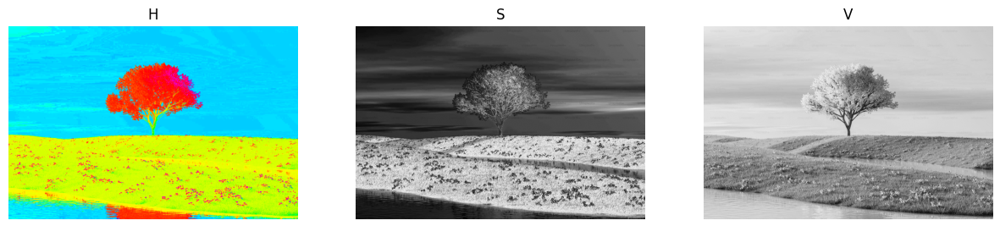
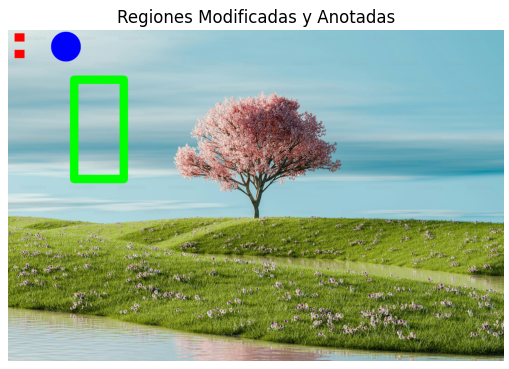
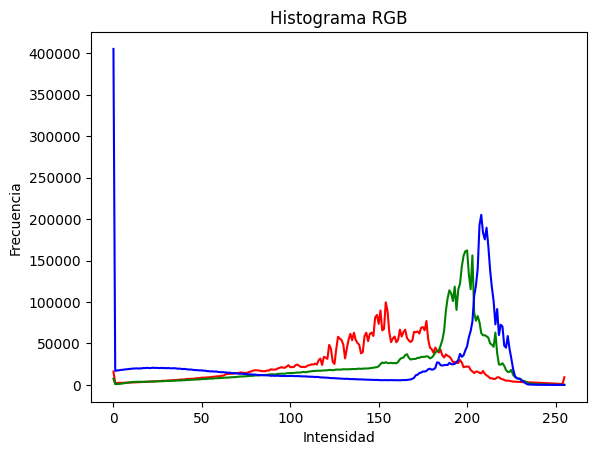
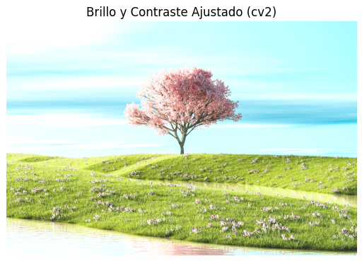

# 🧪 De Píxeles a Coordenadas: Explorando la Imagen como Matriz

## 📅 Fecha  
`2025-04-30`

---

## 🎯 Objetivo del Taller

Explorar cómo una imagen digital puede ser representada como una matriz numérica, accediendo a sus valores por píxel para modificarlos. Se aplicaron técnicas de manipulación directa de canales de color, secciones específicas mediante slicing, y ajustes de brillo y contraste. El taller también incluyó la generación de histogramas para el análisis visual de intensidad.

---

## 🧠 Conceptos Aprendidos

✅ Representación de imágenes como matrices NumPy.

✅ Manipulación de regiones específicas con slicing, seleccionar secciones rectangulares de una imagen mediante índices de matriz para modificarlas, cambiarlas de color o reemplazarlas por otras partes de la imagen.

✅ Separación de canales de color, se accedio por separado a los canales RGB y HSV.

✅ Visualización de histogramas de intensidad para entender la distribución de los valores de color en una imagen.

✅ Ajuste manual y automático de brillo y contraste aplicando fórmulas matemáticas para modificar estos parámetros y utilizamos funciones optimizadas de OpenCV como cv2.convertScaleAbs() para hacerlo de forma eficiente.
---

## 🔧 Herramientas y Entornos

- Python (`opencv-python`, `numpy`, `matplotlib`)
- Jupyter / Google Colab

📌 Usa las herramientas según la [guía de instalación oficial](./guia_instalacion_entornos_visual.md)

---

## 📁 Estructura del Proyecto
```
2025-04-30_taller_imagen_matriz_pixeles/ 
├── python/ # scripts y notebooks 
├── datos/ # imagen de entrada 
├── resultados/ # capturas, gifs 
├── README.md
```

---

## 🧪 Implementación

### 🔹 Etapas realizadas

1. Carga de imagen con OpenCV.
2. Separación de canales de color (RGB y HSV).
3. Modificación de regiones específicas con slicing.
4. Reemplazo de zonas dentro de la imagen.
5. Cálculo y visualización de histogramas por canal.
6. Ajuste de brillo y contraste manual y con `cv2.convertScaleAbs`.

### 🔹 Código relevante

Durante el taller modifiqué regiones específicas de una imagen usando slicing, como en img_rgb[50:150, 100:200] = [255, 0, 0], que cambia un área rectangular al color rojo puro. Para ajustar brillo y contraste utilicé cv2.convertScaleAbs(img_rgb, alpha=1.3, beta=40), que aplica una transformación lineal a cada píxel de forma eficiente y segura. También generé histogramas por canal con cv2.calcHist(), lo que permitió visualizar la distribución de intensidades en los colores primarios y analizar la composición visual de la imagen.

```python
# Slicing: cambio de color en una región
img_rgb[50:150, 100:200] = [255, 0, 0]  # Sección cambiada a rojo

# Ajuste de brillo y contraste
img_adjust = cv2.convertScaleAbs(img_rgb, alpha=1.3, beta=40)

# Histograma
for i, col in enumerate(('r', 'g', 'b')):
    hist = cv2.calcHist([img_rgb], [i], None, [256], [0, 256])
    plt.plot(hist, color=col)
```

## 📊 Resultados Visuales

### Imagen original


### Canal RGB


### Canal HSV


### Modificacion de Regiones


### Histograma de intensidades


### Ajustes de brillo y contraste de forma manual


### Sliders para modificar brillo y contraste en tiempo real 


## 🧩 Prompts Usados

- ¿Cómo puedo cargar una imagen en color usando OpenCV con cv2.imread() y visualizarla con cv2.imshow() o matplotlib?
- ¿Cómo puedo usar slicing en NumPy para cambiar el color de una región rectangular de una imagen cargada con OpenCV?
- ¿Cómo puedo aplicar ajustes de brillo y contraste en una imagen usando cv2.convertScaleAbs() en OpenCV?

---

## 💬 Reflexión Final
Durante la realizacion pude comprender cómo una imagen digital es, en el fondo, una estructura de datos compuesta por matrices tridimensionales (ancho, alto y canales). El acceso y manipulación mediante slicing me mostró que se puede cambiar cualquier parte de la imagen de forma directa y precisa, lo que tiene muchas aplicaciones en visión por computador.

La parte más interesante fue la generación del histograma por canal y cómo pequeñas modificaciones en el brillo/contraste afectan su forma. Me costó al principio comprender cómo usar correctamente cv2.convertScaleAbs() y manejar correctamente las dimensiones de la imagen al aplicar slicing, pero con práctica se volvió claro. En el futuro, me gustaría aplicar esto para segmentar zonas de interés o realizar filtros personalizados por regiones.

