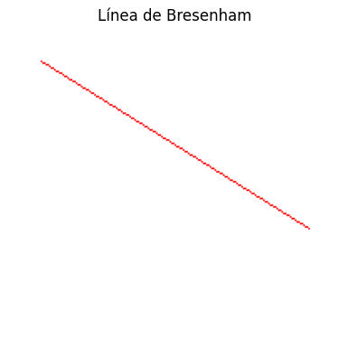
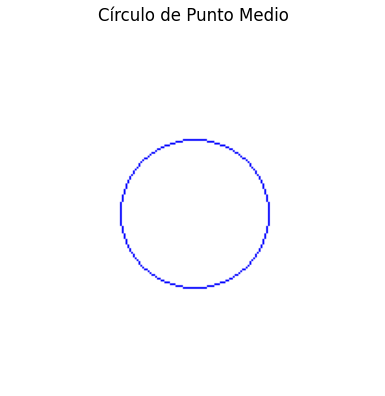
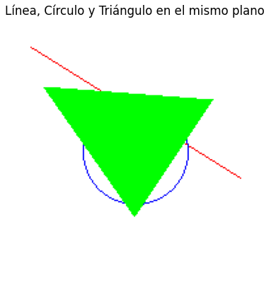

# 🧪 Taller - Rasterización desde Cero: Dibujando con Algoritmos Clásicos

## 📅 Fecha  
`2025-05-02` 

---

## 🎯 Objetivo del Taller  
Comprender e implementar algoritmos clásicos de rasterización (Bresenham, punto medio y scanline) para generar primitivas gráficas básicas (líneas, círculos y triángulos) píxel a píxel, sin usar librerías gráficas de alto nivel. Esto permite entender los fundamentos del renderizado 2D y la construcción de imágenes digitales desde cero.

---

## 🧠 Conceptos Aprendidos  

✅ Rasterización de primitivas gráficas (líneas, círculos, triángulos)
✅ Algoritmos de dibujo sin antialiasing
✅ Cálculo incremental para eficiencia en gráficos
✅ Visualización de píxeles con Pillow y Matplotlib
✅ Control manual de buffer de imagen
✅ Interpolación lineal de coordenadas
✅ Simetría en renderizado (círculos)
✅ Uso de estructuras condicionales para control de flujo en gráficos

---

## 🔧 Herramientas y Entornos  

- Python
  - Pillow (creación y edición de imágenes)
  - Matplotlib (visualización)
- Entorno usado: Jupyter Notebook / Google Colab

---

## 📁 Estructura del Proyecto
```
2025-05-02_taller_algoritmos_rasterizacion_basica/  
├── python/               # rasterizacion_algoritmos.ipynb  
├── resultados/           # linea.png, circulo.png, triangulo.png  
├── README.md  
```

## 🧪 Implementación  

### 🔹 Etapas realizadas  
1. **Preparación del entorno**: creación de una imagen en blanco y configuración del sistema de píxeles.
2. **Dibujo de línea con Bresenham**: algoritmo eficiente para rasterizar líneas.
3. **Dibujo de círculo con punto medio**: trazo circular utilizando decisiones incrementales.
4. **Relleno de triángulo con scanline**: uso de interpolación para determinar los límites horizontales por fila.
5. **Visualización y guardado**: mostrar y guardar las figuras generadas individualmente y en conjunto.

### 🔹 Código relevante  

```python
# Algoritmo de Bresenham para líneas
# Utiliza sólo operaciones enteras para determinar el píxel más cercano a una línea ideal.
# Calcula un "error" entre la línea ideal y los píxeles, y lo ajusta en cada paso.
while True:
    pixels[x0, y0] = (255, 0, 0)  # colorea el píxel actual
    if x0 == x1 and y0 == y1:
        break
    e2 = 2 * err
    if e2 > -dy:
        err -= dy
        x0 += sx
    if e2 < dx:
        err += dx
        y0 += sy
```

```python
# Algoritmo de punto medio para círculos
# Dibuja un octante del círculo y refleja los puntos usando simetría para completar el trazo.
# La decisión se toma en función de un parámetro "p" que indica si el punto siguiente debe ir en diagonal o hacia arriba.
while x >= y:
    for dx, dy in [(x, y), (y, x), (-x, y), (-y, x), (-x, -y), (-y, -x), (x, -y), (y, -x)]:
        pixels[x0 + dx, y0 + dy] = (0, 0, 255)
    y += 1
    if p <= 0:
        p += 2 * y + 1
    else:
        x -= 1
        p += 2 * y - 2 * x + 1

```

```python
# Relleno de triángulo por scanline
# Interpola los extremos de cada fila del triángulo entre los puntos dados
# y traza una línea horizontal entre los extremos para cada fila.
for y, xl, xr in zip(range(y1, y3), x13, x_left):
    for x in range(min(xl, xr), max(xl, xr)):
        pixels[x, y] = (0, 255, 0)

```

## 📊 Resultados Visuales

### Algoritmo de Bresenham para líneas


### # Algoritmo de punto medio para círculos


### Relleno de triángulo por scanline


### Union de Algoritmos



## 🧩 Prompts Usados

- ¿Cómo se puede rasterizar un círculo usando solo operaciones enteras? Explica el algoritmo de punto medio.
- Dame un ejemplo en Python para rellenar un triángulo usando interpolación de scanlines.
- Genérame un ejemplo completo en Python que dibuje una línea, un círculo y un triángulo sobre la misma imagen usando Pillow.
- Explícame cómo usar simetría para optimizar el dibujo de un círculo con el algoritmo de punto medio.

---

## 💬 Reflexión Final
El taller permitió una comprensión detallada del proceso de rasterización manual, usando algoritmos que se ejecutan a nivel de píxel. Cada método tiene sus ventajas:

- Bresenham es ideal para líneas por su rapidez y precisión.

- El algoritmo de punto medio se beneficia de la simetría para construir curvas sin funciones costosas.

- El método de scanline resulta eficaz para rellenar polígonos, aunque requiere una buena gestión de interpolaciones.

Comprender estos algoritmos fortalece los fundamentos gráficos y permite avanzar hacia conceptos como shaders, buffers de profundidad, texturizado o renderizado 3D. A largo plazo, son útiles en motores gráficos, software embebido, simuladores y videojuegos.