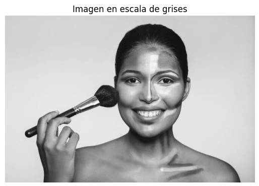
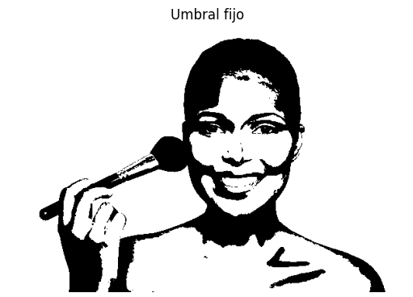
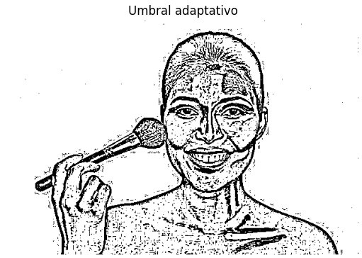
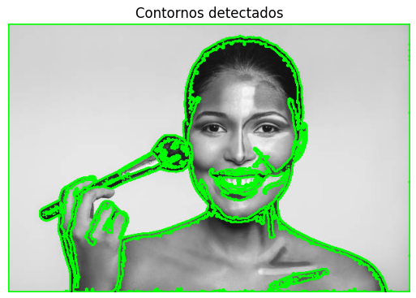
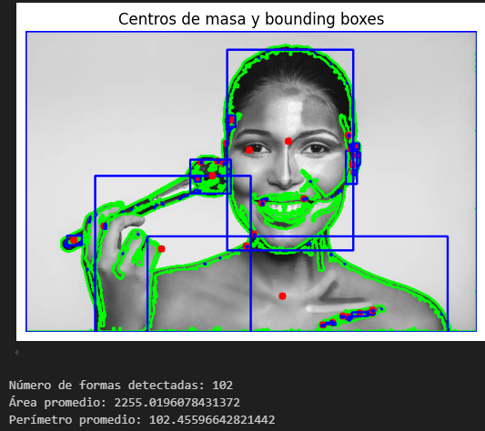

# 🧪 Segmentando el Mundo: Binarización y Reconocimiento de Formas

## 📅 Fecha
2025-05-02 – Fecha de realización

---

## 🎯 Objetivo del Taller
Explorar técnicas básicas de segmentación de imágenes mediante binarización y reconocimiento de formas simples. Se busca aplicar umbralización (fija y adaptativa), detectar contornos, calcular métricas y visualizar bounding boxes y centros de masa sobre regiones segmentadas.

---

## 🧠 Conceptos Aprendidos

✅ Segmentación de imágenes: Binarización mediante umbral fijo y adaptativo.

✅ Detección de contornos: Localización de bordes y formas en imágenes binarizadas.

✅ Cálculo de momentos: Uso de cv2.moments() para encontrar centros de masa.

✅ Bounding boxes: Detección y visualización de rectángulos delimitadores.

✅ Transformaciones geométricas: Representación de objetos mediante áreas, perímetros y centroides.

✅ Procesamiento morfológico básico: Identificación y análisis de formas simples.

✅ Visualización científica: Uso de matplotlib y OpenCV para graficar resultados procesados.

✅ Manejo de estructuras jerárquicas de contornos: Parámetros de cv2.findContours() (RETR_EXTERNAL vs. otros).

✅ Manejo de tipos de umbral adaptativo: Diferencias entre ADAPTIVE_THRESH_MEAN_C y GAUSSIAN_C.

---

## 🔧 Herramientas y Entornos

- Python (opencv-python, numpy, matplotlib)
- Jupyter / Google Colab

---

## 📁 Estructura del Proyecto

```
2025-05-02_taller_segmentacion_formas/
├── python/     # scripts y notebooks 
├── datos/      # imagen de entrada 
├── resultados/ # capturas, gifs 
├── README.md
```
---

## 🧪 Implementación

### 🔹 Etapas realizadas

1. **Preparación de datos**  
   Se cargó una imagen en escala de grises desde el directorio `datos/`.

2. **Aplicación de algoritmo**  
   Se aplicaron dos métodos de umbralización: umbral fijo (`cv2.threshold`) y umbral adaptativo (`cv2.adaptiveThreshold`).  
   Luego se usó `cv2.findContours()` para detectar contornos, se calcularon momentos con `cv2.moments()` y se generaron bounding boxes (`cv2.boundingRect()`).

3. **Visualización**  
   Se dibujaron los contornos, centros de masa y cajas sobre la imagen original usando OpenCV y se mostraron con `matplotlib`.

4. **Guardado de resultados**  
   Se exportaron las visualizaciones clave como GIFs en la carpeta `resultados/`.

---

### 🔹 Código relevante
El código aplica segmentación adaptativa para binarizar la imagen y luego detecta contornos con cv2.findContours(). Para cada forma encontrada, calcula el centro de masa con cv2.moments() y dibuja un círculo rojo. También genera una bounding box para cada contorno, representada como un rectángulo azul sobre la imagen. 

```python
# Segmentación binaria adaptativa + detección de contornos
thresh = cv2.adaptiveThreshold(img, 255, cv2.ADAPTIVE_THRESH_GAUSSIAN_C,
                               cv2.THRESH_BINARY, 11, 2)
contours, _ = cv2.findContours(thresh, cv2.RETR_EXTERNAL, cv2.CHAIN_APPROX_SIMPLE)
for cnt in contours:
    M = cv2.moments(cnt)
    if M['m00'] != 0:
        cx = int(M['m10']/M['m00'])
        cy = int(M['m01']/M['m00'])
        cv2.circle(output_img, (cx, cy), 5, (0, 0, 255), -1)
    x, y, w, h = cv2.boundingRect(cnt)
    cv2.rectangle(output_img, (x, y), (x + w, y + h), (255, 0, 0), 2)
```

## 📊 Resultados Visuales

### Imagen original en escala de grises


### Umbral Fijo


### Umbral Adaptativo


### Contornos detectados


### Centro de masa y bounding boxes


### Procesar imagenes desde webcam


## 🧩 Prompts Usados

- Explícame paso a paso cómo hacer segmentación de imágenes con OpenCV en Python
- Dame un ejemplo de cómo usar cv2.findContours() para detectar formas en una imagen
- ¿Cómo puedo calcular el centro de masa de un contorno con OpenCV?

---

## 💬 Reflexión Final
A lo largo de este taller, pude reforzar mis conocimientos en procesamiento de imágenes, especialmente en técnicas de binarización y análisis morfológico. Aprendí a elegir entre umbral fijo y adaptativo según las necesidades del momento, y también a interpretar métricas como el área y el perímetro de las formas segmentadas.

Lo más interesante fue poder detectar y visualizar los contornos y centros de masa, ya que me permitió entender mejor cómo se estructuran las formas dentro de una imagen. En futuros proyectos, me gustaría trabajar con procesamiento en tiempo real desde la webcam, creando una herramienta interactiva para la detección de formas. También me gustaría explorar métricas más avanzadas, como la circularidad o la elongación, para mejorar el análisis de las formas detectadas.

