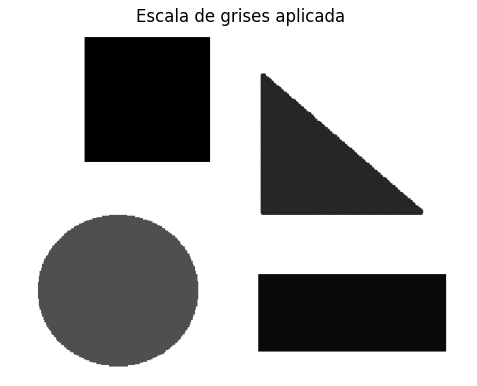
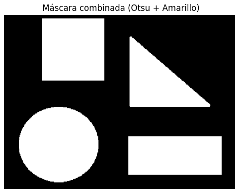
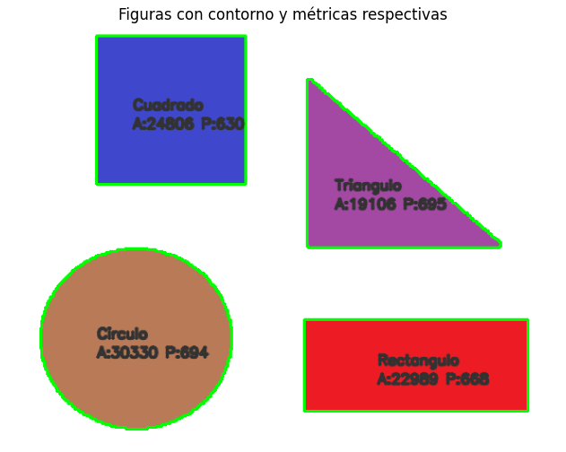
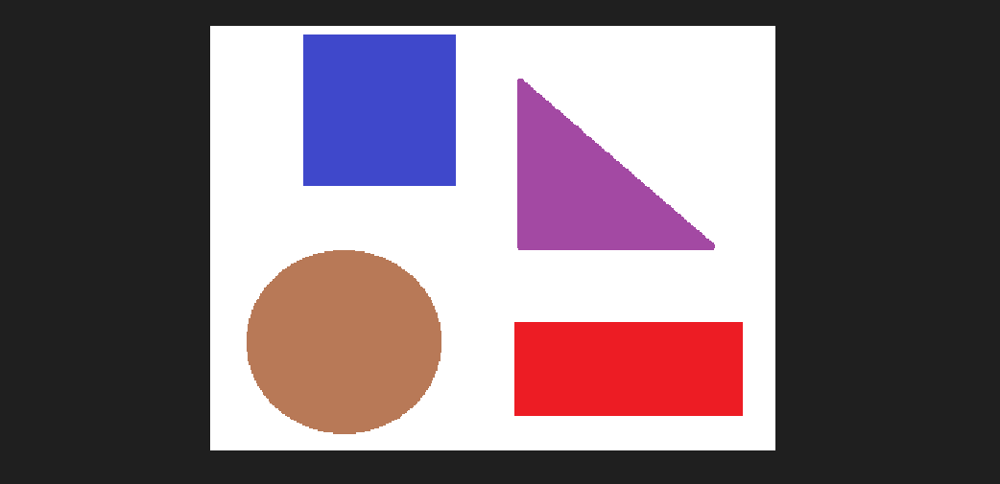

# 🧪 Análisis de Figuras Geométricas: Centroide, Área y Perímetro

## 📅 Fecha
`2025-05-03` – Fecha de entrega o realización

---

## 🎯 Objetivo del Taller

El objetivo del taller es **detectar formas geométricas simples** (círculos, cuadrados y triángulos) en imágenes binarizadas, y **calcular sus propiedades geométricas**: área, perímetro y centroide. Además, el taller busca desarrollar habilidades para extraer métricas relevantes de contornos detectados, visualizarlas y clasificarlas de acuerdo con sus vértices.

---

## 🧠 Conceptos Aprendidos

- [x] Detección de contornos en imágenes procesadas
- [x] Cálculo de áreas, perímetros y centroides usando OpenCV
- [x] Clasificación de formas geométricas en función del número de vértices
- [x] Visualización de métricas sobre imágenes
- [x] Uso de técnicas de segmentación para combinar diferentes formas

---

## 🔧 Herramientas y Entornos

- Python (`opencv-python`, `numpy`, `matplotlib`)
- Jupyter Notebook o Google Colab

---

## 🧪 Implementación

### 🔹 Etapas realizadas
1. **Preparación de datos**: Se cargó una imagen binarizada o se generó una usando Otsu y segmentación de color.
2. **Detección de contornos**: Usando `cv2.findContours()` se identificaron los contornos de las figuras presentes en la imagen.
3. **Cálculo de métricas**: Para cada contorno detectado, se calculó el área, perímetro y centroide utilizando las funciones de OpenCV.
4. **Clasificación de figuras**: Se clasifica cada forma según el número de vértices en su contorno, identificando triángulos, cuadrados, rectángulos y círculos.
5. **Visualización de resultados**: Se dibujaron los contornos y se etiquetaron con las métricas calculadas sobre la imagen original.

### 🔹 Código relevante
Este es el código utilizado para detectar contornos en una imagen binarizada, calcular las métricas geométricas (área, perímetro y centroide) y clasificar las figuras según su número de vértices (triángulo, cuadrado, círculo, etc.). Además, dibuja los contornos sobre la imagen original y etiqueta cada figura con sus métricas.

```python
# Detección de contornos en la imagen binarizada combinada
contornos_detectados, _ = cv2.findContours(mascara_final, cv2.RETR_LIST, cv2.CHAIN_APPROX_SIMPLE)

# Cálculo de métricas y clasificación
for indice, contorno in enumerate(contornos_detectados, start=1):
    superficie = cv2.contourArea(contorno)
    longitud = cv2.arcLength(contorno, True)

    # Cálculo del centroide
    momentos = cv2.moments(contorno)
    if momentos['m00'] != 0:
        centro_x = int(momentos['m10'] / momentos['m00'])
        centro_y = int(momentos['m01'] / momentos['m00'])
    else:
        centro_x, centro_y = 0, 0

    # Clasificación de la forma
    forma_aproximada = cv2.approxPolyDP(contorno, 0.04 * longitud, True)
    lados = len(forma_aproximada)
    if lados == 3:
        tipo = 'Triángulo'
    elif lados == 4:
        x, y, w, h = cv2.boundingRect(forma_aproximada)
        proporcion = w / float(h)
        tipo = 'Cuadrado' if 0.95 <= proporcion <= 1.05 else 'Rectángulo'
    elif lados > 4:
        tipo = 'Círculo'
    else:
        tipo = 'Figura'

    # Dibujar contorno y etiquetar la imagen con las métricas
    cv2.drawContours(imagen_final, [contorno], -1, (0, 255, 0), 2)
    texto_info = f"{tipo}\nA:{superficie:.0f} P:{longitud:.0f}"
    for i, linea in enumerate(texto_info.split('\n')):
        cv2.putText(imagen_final, linea, (centro_x - 40, centro_y + i*20),
                    cv2.FONT_HERSHEY_SIMPLEX, 0.5, (50, 50, 50), 2, cv2.LINE_AA)
```

## 📊 Resultados Visuales

### Imagen original en escala de grises


### Imagen binarizada


### Contorno sobre una copia de la imagen original, con sus métricas





## 🧩 Prompts Usados

- Explícame cómo detectar contornos en una imagen binarizada con OpenCV.
- ¿Cómo puedo calcular el centroide de una figura usando los momentos en OpenCV?
- ¿Qué criterio puedo usar para clasificar figuras como triángulo, cuadrado o círculo con Python?
- ¿Cómo dibujo los contornos detectados sobre la imagen original?

---

## 💬 Reflexión Final
Durante la realizacion de este laboratotio, donde trabaje nuevamente con OpenCV pude reforzar mis conocimientos sobre procesamiento de imágenes.Ademas aprendí a detectar contornos, calcular métricas geométricas como área y perímetro, y visualizar estas métricas de manera clara sobre las figuras detectadas.

El proceso más interesante fue la clasificación automática de las formas geométricas, que me permitió mejorar mi comprensión de cómo aproximar polígonos y clasificarlos en categorías como triángulos, cuadrados y círculos. Sin embargo, lo más complejo fue asegurarme de que todas las métricas se dibujaran correctamente sin superponerse a las figuras.

En futuros proyectos, me gustaría integrar más métricas avanzadas y trabajar con imágenes más complejas que incluyan ruido o formas irregulares.

