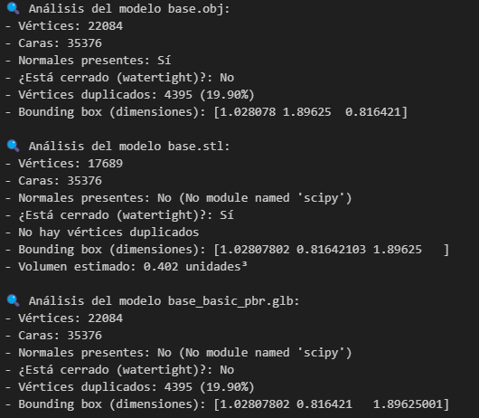
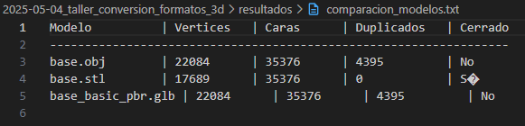
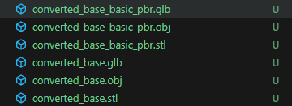
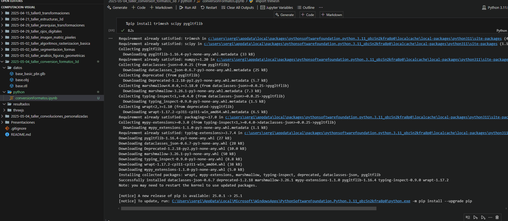

# 🧪 Importando el Mundo: Visualización y Conversión de Formatos 3D

## 📅 Fecha

`2025-05-04` – Fecha de realización

---

## 🎯 Objetivo del Taller

Explorar la estructura interna y compatibilidad entre formatos de modelos 3D (.OBJ, .STL, .GLTF), aplicando técnicas de análisis geométrico, visualización básica y conversión de formatos utilizando Python y Trimesh.
El objetivo de este taller es comparar y convertir entre los formatos de modelos 3D más comunes: .OBJ, .STL y .GLTF/GLB. Además, se busca visualizar las diferencias en cuanto a geometría y materiales en estos formatos, así como explorar las estructuras internas de los archivos 3D y su compatibilidad con diversas plataformas de visualización.

---

## 🧠 Conceptos Aprendidos

Lista de conceptos clave aplicados en el taller:

- [x] Transformaciones geométricas (bounding box, volumen, normalización de vértices)
- [x] Análisis de mallas 3D (conteo de vértices y caras, detección de duplicados, watertight)
- [x] Conversión entre formatos de modelos 3D (.obj, .stl, .glb)
- [x] Uso de estructuras tipo `Scene` y combinación de geometrías múltiples
- [x] Visualización indirecta mediante inspección de propiedades y comparación tabular
- [x] Automatización de flujos de análisis y exportación
- [x] Carga y visualización de modelos 3D en Three.js
- [x] Comparación entre los formatos `.OBJ`, `.STL` y `.GLB`
- [x] Cálculo del número de vértices y propiedades de los modelos
- [x] Uso de React Three Fiber para integrar visualización 3D en aplicaciones React
- [x] Implementación de controles de exploración (OrbitControls)
- [x] Implementación de selectores dinámicos para alternar entre formatos

---

## 🔧 Herramientas y Entornos

Especifica los entornos usados:

- Python (`trimesh`, `numpy`, `open3d`, `assimp`)
- Jupyter / Google Colab
- Exploración de archivos .OBJ, .STL, .GLTF
- React (React Three Fiber, OrbitControls)
- Three.js (OBJLoader, STLLoader, GLTFLoader)
- Webpack o Create React App para la gestión de proyectos de React
- Visualización y renderizado 3D

---

## 📁 Estructura del Proyecto
```
2025-04-28_taller_construyendo_mundo_3d/
├── python/              # Implentacion python/
├── threejs/             # Implentacion react usando threejs/
├── datos/               # Modelos 3D originales
├── resultados/          # Gifs resultantes, metricas y conversion de modelos
├── README.md
```
## 🧪 Implementación

Explica el proceso:

### 🔹 Etapas realizadas

#### 🐍 Python
1. **Carga de modelos 3D** desde `/datos/`, filtrando por extensiones válidas (.obj, .stl, .glb, .gltf) usando `trimesh`.
2. **Análisis de propiedades geométricas**, como vértices, caras, normales, duplicados, volumen, *watertight* y dimensiones del bounding box.
3. **Conversión automatizada** de cada modelo a formatos .OBJ, .STL y .GLB, usando `modelo.export`.
4. **Comparación tabular de métricas clave** (vértices, caras, duplicados, cerrado) entre modelos, mostrada en consola y exportada como `.txt`.
5. **Exportación final** de resultados a la carpeta `/resultados/` para uso en visualizadores externos como Three.js.

#### 🌐 React.js

1. **Carga de modelos 3D**: Utilizamos Three.js junto con los `OBJLoader`, `STLLoader` y `GLTFLoader` para cargar los modelos en los formatos `.OBJ`, `.STL` y `.GLB`.
2. **Conversión de geometría**: Para el formato `.STL`, se convirtió la geometría cargada en un mesh que luego se visualiza con material estándar.
3. **Visualización**: Se implementó un componente React que permite alternar entre los tres formatos y visualizar sus diferencias.
4. **Interactividad**: Se agregaron controles de órbita (OrbitControls) para permitir la exploración del modelo en 3D.
5. **Cálculo de vértices**: Se implementó una función que calcula y muestra el número de vértices de los modelos cargados.

### 🔹 Justificación del uso de **GLB** en vez de **GLTF**  

- **GLTF** es un formato de archivo que describe la geometría, materiales, texturas y animaciones de un modelo 3D, y está basado en JSON. Es un formato muy eficiente y ampliamente soportado en la industria. Sin embargo, **GLTF** tiene la limitación de ser un formato en texto, lo que puede hacer que los archivos sean más grandes y menos eficientes para la carga en aplicaciones web, debido a la necesidad de realizar múltiples solicitudes HTTP para cargar texturas y otros recursos.

- **GLB**, por otro lado, es la versión binaria de **GLTF**, y tiene una ventaja principal: todo el contenido, incluidos los datos de geometría, materiales, texturas y animaciones, está contenido en un solo archivo binario. Esto mejora significativamente la eficiencia en la carga y el manejo de los modelos, ya que reduce el número de archivos y solicitudes HTTP necesarios.

Por estas razones, **se eligió el formato GLB** para este taller, ya que es más adecuado para aplicaciones web interactivas y ofrece mejores tiempos de carga, especialmente cuando se trabaja con modelos complejos que contienen texturas y animaciones.


###  🔹 Código relevante

### 🐍 Python  
Este bloque de código realiza el análisis central de cada modelo 3D. Extrae propiedades esenciales como cantidad de vértices y caras, presencia de normales, si la malla está cerrada (`watertight`), si hay vértices duplicados, así como el tamaño del *bounding box* y el volumen estimado (si aplica). Estos datos permiten evaluar la integridad y calidad de los modelos antes de convertirlos a otros formatos:

```python
# Propiedades básicas
print(f"- Vértices: {len(modelo.vertices)}")
print(f"- Caras: {len(modelo.faces)}")

# Normales
try:
    _ = modelo.vertex_normals
    print(f"- Normales presentes: Sí")
except Exception as e:
    print(f"- Normales presentes: No ({str(e)})")

# Watertight (cerrado)
print(f"- ¿Está cerrado (watertight)?: {'Sí' if modelo.is_watertight else 'No'}")

# Vértices duplicados
unicos = np.unique(modelo.vertices, axis=0)
duplicados = len(modelo.vertices) - len(unicos)
if duplicados:
    print(f"- Vértices duplicados: {duplicados} ({duplicados / len(modelo.vertices) * 100:.2f}%)")
else:
    print("- No hay vértices duplicados")

# Bounding box y volumen (si aplica)
print(f"- Bounding box (dimensiones): {modelo.bounding_box.extents}")
if modelo.is_volume:
    print(f"- Volumen estimado: {modelo.volume:.3f} unidades³")
```

### 🌐 React Three Fiber (App.jsx)

- Permitir la visualización comparativa en tiempo real de diferentes formatos de modelo 3D.
- Mostrar información geométrica relevante (como el número de vértices).
- Brindar una interfaz limpia y controlable para alternar entre formatos desde una UI simple.
- Preparar la base para extender el proyecto a tareas más complejas como análisis de geometría, comparación de materiales, optimización de modelos o exportación.

```jsx
import React, { useEffect, Suspense } from 'react';
import { useLoader } from '@react-three/fiber';
import { OrbitControls } from '@react-three/drei';
import { OBJLoader } from 'three/examples/jsm/loaders/OBJLoader';
import { STLLoader } from 'three/examples/jsm/loaders/STLLoader';
import { GLTFLoader } from 'three/examples/jsm/loaders/GLTFLoader';
import * as THREE from 'three';

export default function ModelViewer({ format, onModelLoaded }) {
  const objModel = useLoader(OBJLoader, '/model.obj');
  const stlGeometry = useLoader(STLLoader, '/model.stl');
  const glbModel = useLoader(GLTFLoader, '/model.glb');

  const stlMesh = new THREE.Mesh(stlGeometry, new THREE.MeshStandardMaterial({ color: 'gray' }));

  useEffect(() => {
    if (format === 'OBJ') {
      onModelLoaded(objModel);
    } else if (format === 'STL') {
      onModelLoaded(stlMesh);
    } else if (format === 'GLB') {
      onModelLoaded(glbModel.scene);
    }
  }, [format, objModel, stlMesh, glbModel]);

  return (
    <>
      <ambientLight intensity={0.5} />
      <pointLight position={[10, 10, 10]} />
      <OrbitControls />
      <Suspense fallback={null}>
        {format === 'OBJ' && <primitive object={objModel} />}
        {format === 'STL' && <primitive object={stlMesh} />}
        {format === 'GLB' && <primitive object={glbModel.scene} />}
      </Suspense>
    </>
  );
}
```


## 📊 Resultados Visuales
### 🐍 Python   
#### 📐 Análisis geométrico de un modelo


#### 📊 Comparación de métricas entre modelos


#### 🔁 Conversión a múltiples formatos (OBJ, STL, GLB)


#### 🎞️ Proceso completo en ejecución (GIF)



### 🌐 React  
Modelo .OBJ:
El modelo cargado en formato .OBJ tiene la geometría correctamente representada, pero no posee materiales ni texturas por defecto. Esto significa que, al visualizarlo, el modelo aparece en un color plano, sin detalles visuales como profundidad o sombras. 

Modelo .STL:
El formato .STL tampoco incluye materiales ni texturas, lo que provoca que el modelo se visualice en un color gris uniforme. Aunque las formas geométricas están representadas correctamente, la falta de información de color y de suavizado de las superficies hace que el modelo luzca más básico en comparación con GLB. 

Modelo .GLB:
El formato .GLB, siendo la versión binaria del GLTF, mantiene toda la información de materiales, texturas y animaciones dentro de un solo archivo. Esto se refleja en una visualización mucho más detallada, con materiales aplicados correctamente, y texturas en las superficies. Este modelo se ve más realista, lo que facilita la percepción de la profundidad y los detalles del objeto 3D.


---

🧩 Prompts Usados


- ¿Cómo puedo comparar varios modelos 3D y generar una tabla apartir de las metricas obtenidas?
- ¿Cuál es la diferencia entre una escena y una malla en Trimesh, y cómo las convierto para analizarlas?
- ¿Cómo visualizo un modelo 3D en Python y guardo una imagen o animación del análisis?
- ¿Qué diferencias visuales o estructurales hay entre formatos 3D como .OBJ, .STL y .GLB?
- ¿Cómo puedo cargar y visualizar modelos 3D en Three.js?
- ¿Cuál es la diferencia entre los formatos GLTF y GLB?
- ¿Cómo puedo contar el número de vértices de un modelo 3D en Three.js?

---

💬 Reflexión Final  

Este taller me permitió reforzar mis conocimientos en el useo y estructura internamente distintos formatos de modelos 3D, más allá de su apariencia visual. Fue especialmente valioso identificar la importancia del preprocesamiento (como eliminar duplicados o verificar que una malla sea cerrada) antes de realizar conversiones entre formatos.

Ademas,he adquirido una comprensión más profunda de los formatos 3D y su compatibilidad entre diferentes plataformas. El uso de GLB, como formato binario eficiente, demostró ser especialmente útil para reducir los tiempos de carga y la complejidad en aplicaciones web interactivas. El proceso de implementación también me permitió mejorar mis habilidades en React Three Fiber y en la manipulación de modelos 3D en Three.js.

El mayor reto fue manejar modelos en formato .glb que contenían múltiples geometrías; resolver esto mediante trimesh.util.concatenate() fue clave. A futuro, me gustaría integrar esta lógica en una interfaz web con React Three Fiber para observar las diferencias de renderizado en tiempo real.

