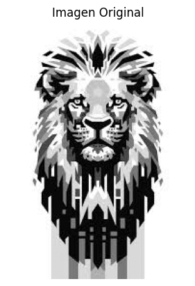
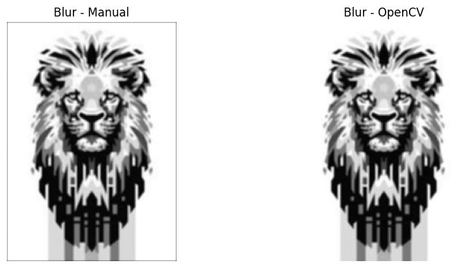
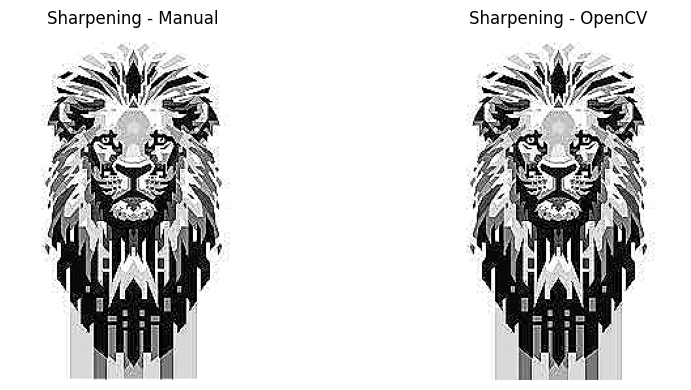
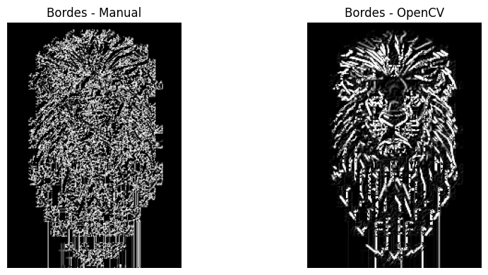
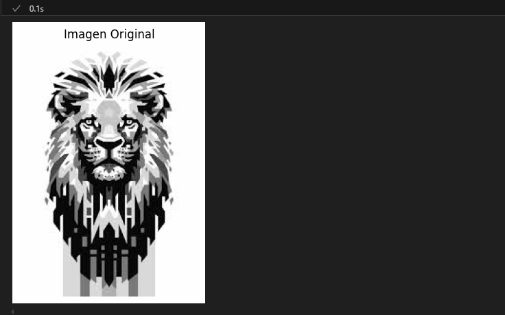

# 🧪 Taller - Filtro Visual: Convoluciones Personalizadas

## 📅 Fecha  
`2025-05-04` – Fecha de entrega

---

## 🎯 Objetivo del Taller

Diseñar e implementar filtros personalizados mediante operaciones de convolución en imágenes, con el fin de modificar bordes, aplicar difuminados o realzar detalles visuales. Se busca entender en profundidad cómo funciona la convolución a nivel de píxel y su impacto visual en el procesamiento de imágenes.

---

## 🧠 Conceptos Aprendidos

Lista los principales conceptos aplicados:

- [x] Convolución manual con matrices (kernels)
- [x] Filtros de enfoque (sharpening)
- [x] Suavizado con promedio (blur)
- [x] Detección de bordes con Sobel
- [x] Cálculo de magnitud de gradiente (combinación de ejes)
- [x] Interfaz gráfica en tiempo real con `cv2.createTrackbar`
- [x] Visualización comparativa entre filtros manuales y OpenCV
- [x] Uso de funciones auxiliares para aplicar filtros personalizados

---

## 🔧 Herramientas y Entornos

- Python (`opencv-python`, `numpy`, `matplotlib`)
- Jupyter Notebook / Google Colab (opcional)

---

## 📁 Estructura del Proyecto
```
2025-05-04_taller_convoluciones_personalizadas/
├── python/ # scripts .py o notebooks
├── datos/ # imágenes de entrada
├── resultados/ # capturas, gifs
├── README.md
```

---

## 🧪 Implementación

### 🔹 Etapas realizadas

1. Carga de imagen en escala de grises.
2. Implementación manual de la convolución 2D con NumPy.
3. Definición de múltiples kernels personalizados para realizar filtros.
4. Comparación visual con filtros de OpenCV (`cv2.filter2D`).
5. Interfaz interactiva en tiempo real con sliders para ajustar el kernel.

### 🔹 Código relevante
A continuación se muestra el bloque principal que define y aplica los filtros más relevantes: enfoque, desenfoque y detección de bordes. Cada filtro se aplica tanto con una función manual de convolución como con la función predefinida de OpenCV para comparar su comportamiento visual y numérico.
```python
# ✴️ Filtro de enfoque (sharpening)
kernel_sharpen = np.array([[0, -1, 0],
                           [-1, 5,-1],
                           [0, -1, 0]])
img_sharp = aplicar_convolucion(img, kernel_sharpen)

# 🌫️ Filtro de suavizado (blur promedio)
kernel_blur = np.ones((3,3), np.float32) / 9
img_blur = aplicar_convolucion(img, kernel_blur)

# 🧭 Filtro de detección de bordes con Sobel
kernel_sobel_x = np.array([[-1, 0, 1],
                           [-2, 0, 2],
                           [-1, 0, 1]])
kernel_sobel_y = np.array([[-1, -2, -1],
                           [0,  0,  0],
                           [1,  2,  1]])

# Aplicación de ambos kernels en X e Y
img_sobel_x = aplicar_convolucion(img, kernel_sobel_x)
img_sobel_y = aplicar_convolucion(img, kernel_sobel_y)

# 🔍 Magnitud del gradiente para combinar direcciones
img_edges = np.sqrt(img_sobel_x**2 + img_sobel_y**2)
img_edges = np.clip(img_edges, 0, 255).astype(np.uint8)

# 🛠️ Aplicar los mismos kernels con OpenCV 
img_cv_sharp = cv2.filter2D(img, -1, kernel_sharpen)
img_cv_blur = cv2.filter2D(img, -1, kernel_blur)
img_cv_edges = cv2.filter2D(img, -1, kernel_sobel_x) + cv2.filter2D(img, -1, kernel_sobel_y)
```

## 📊 Resultados Visuales

### Imagen original en escala de grises


### Kernel Blur


### Kernel Sharpening


### Kernel detección de bordes


### Interfaz interactiva



## 🧩 Prompts Usados

- Explicame paso a paso cómo implementar un filtro de convolución manual en Python con NumPy.
- Agrega una interfaz con sliders que permita controlar el filtro visual aplicado.
- ¿Cómo puedo mostrar la imagen original y la editada en paralelo?
- Aumenta los conceptos aprendidos y explica el código de los kernels de enfoque, blur y bordes.


---

## 💬 Reflexión Final
En la realizacion del taller pude profundizar en cómo los filtros modifican visualmente una imagen a través de matrices de convolución. Reforcé el uso de NumPy para operar directamente sobre píxeles y entendí las diferencias numéricas y visuales entre los filtros manuales y los predefinidos de OpenCV.

La parte más desafiante fue construir una interfaz interactiva que respondiera en tiempo real a cambios en los valores del kernel, especialmente cuando se deben mantener estables los bordes y evitar distorsiones. Sin embargo, fue gratificante ver la visualización comparativa funcionando correctamente. 

En general, este fue un taller muy completo que combinó teoría, práctica y creatividad. Me dio una base sólida para seguir explorando temas más avanzados como visión por computadora en tiempo real o tambien me gustaría integrar estos filtros en un sistema más dinámico, como una aplicación web.

